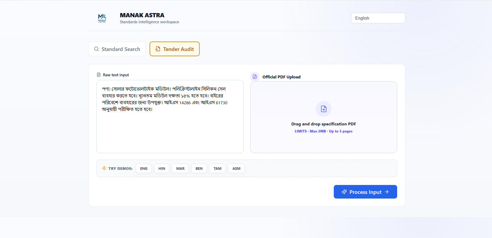
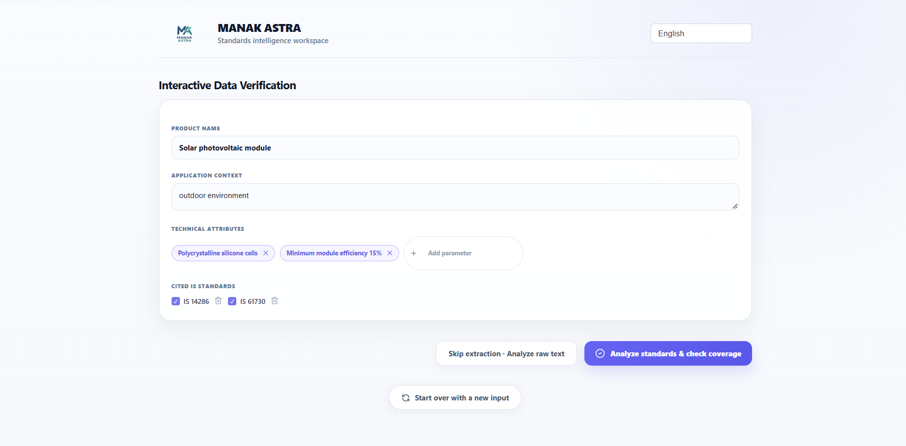
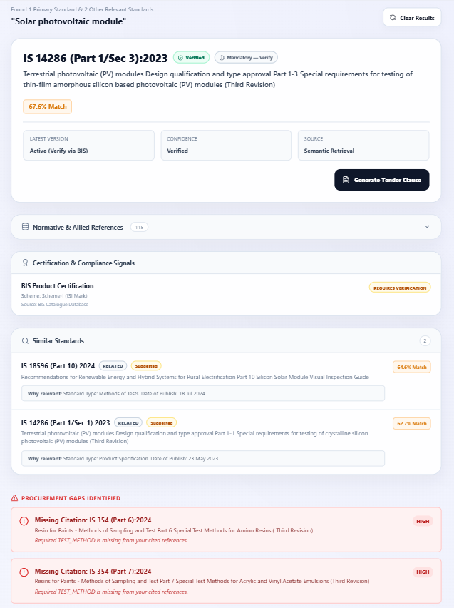
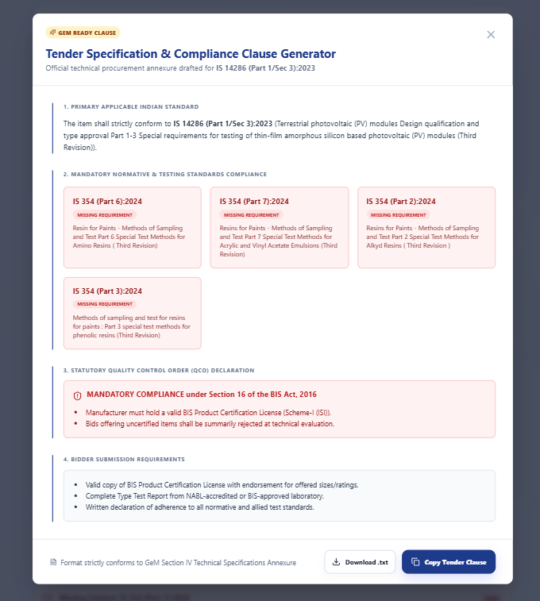
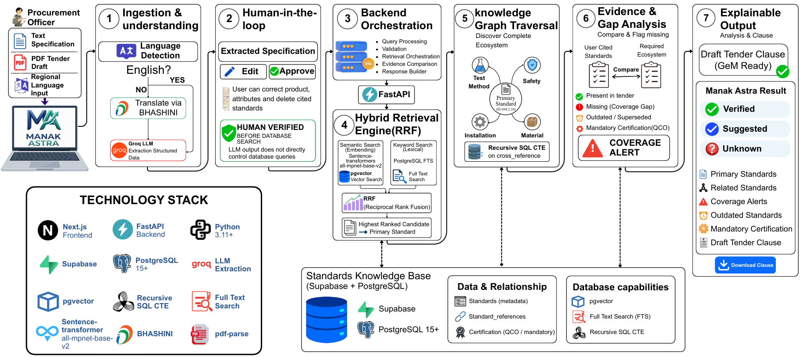

<div align="center">

# MANAK ASTRA 
### AI-Powered Recommendation Engine for Identifying Applicable Indian Standards for Procurement Specifications

[](https://sih.gov.in/)
[](https://manak-astra.vercel.app/)
[](#)

<p align="center">
  
  
  
  
  
  
  
</p>

**Manak Astra** is a deterministic, pre-publication **Coverage Gap Auditor** and standards intelligence workspace designed for procurement officials. It mathematically audits tender drafts against a verified BIS knowledge graph to prevent compliance failures before publication.

> **AI helps, but doesn't decide.** 
> Manak Astra enforces strict **Human-in-the-Loop (HITL)** verification before database retrieval, ensuring absolute compliance and eliminating AI hallucinations.

### 📺  Prototype
[](https://www.youtube.com/watch?v=V4zpoWKHAhY)
[](https://manak-astra.vercel.app/)

</div>

---

## 📌 Problem Statement

**Smart India Hackathon 2026 — Problem Statement ID: SIH26108**

Procurement tenders can contain complex technical, functional, and compliance requirements. It can be difficult to trace all applicable standards, related standards, amendments, revisions, and mandatory certification requirements. 

This can lead to:
* 📉 **Procurement Risk:** Incomplete requirements allowing non-compliant products.
* ⏳ **Delays:** 4-6 months of delays due to specification gaps.
* ❌ **Compliance Failures:** Referencing outdated, superseded, or withdrawn standards.

---

## ✨ Key Features & Capabilities

### 🔎 1. BIS Standards Search
Search for potentially applicable Indian Standards using product and technical requirements instead of just exact keywords.

### 📋 2. Tender Audit (Pre-Publication)
Upload a 50-page PDF tender. The system chunks it, isolates technical requirements from administrative noise, and identifies standards that may be missing.

### 🤖 3. AI Information Extraction
Extracts functional requirements, product attributes, quantities, and compliance requirements directly from raw text.

### 👤 4. Human-in-the-Loop Verification
Before database retrieval, users can review extracted information, edit product details, modify attributes, and approve the structured specification. The LLM output does **not** directly control database queries.

### 🔗 5. Related Standards Discovery
The system looks beyond a single standard to identify primary standards, related testing methods, and cross-referenced supporting standards.

### 🚨 6. Coverage Gap Audit
Traverses our PostgreSQL Knowledge Graph using Recursive CTEs to flag gaps. Highlights what is present in the tender vs. what is missing (e.g., missing test methods or mandatory QCO certifications).

### 📅 7. Latest & Mandatory Standards Check
Tracks revisions, amendments, obsolete standards, and Statutory Quality Control Orders (QCOs) to generate GeM-ready tender clauses.

### 🌐 8. Multilingual Procurement Support
Utilizes the **BHASHINI** translation layer to support procurement requirements in English and 22 scheduled Indian languages.

---

## 📸 System Previews

### Dashboard & Multilingual Standard Search and Audit 
<p align="center">
  
</p>

### Tender Audit & Human-in-the-Loop Verification
<p align="center">
  
</p>

### Coverage Gap Analysis & Red Alerts
<p align="center">
  
</p>

### GEM Ready Tender Clause
<p align="center">
  
</p>

---

## 🏗️ System Architecture & Data Flow

Standard AI chatbots fail in procurement because they hallucinate facts. Manak Astra succeeds through strict architectural boundaries: **LLMs only understand language, while PostgreSQL strictly verifies facts.**

<p align="center">
  
</p>

## 💻 Tech Stack

### Frontend
* **Framework:** Next.js (React)
* **Styling:** Custom CSS / Tailwind
* **Deployment:** Vercel

### Backend & AI
* **Framework:** FastAPI (Python 3.11+)
* **LLM Provider:** Groq (`openai/gpt-oss-20b`) for structured extraction
* **Translation:** BHASHINI API
* **Deployment:** Railway.app

### Database & Search (The Core)
* **Database:** Supabase (PostgreSQL 15+)
* **Vector Store:** `pgvector`
* **Embeddings:** `sentence-transformers/all-mpnet-base-v2` (768 dimensions)
* **Graph Traversal:** Recursive SQL CTEs
* **Lexical Search:** PostgreSQL Full Text Search (FTS)

## 🎯 Target Users & Impact
* Procurement Officers: Faster identification of applicable BIS standards. Transforms a 3-hour manual PDF audit into a 20-second automated pipeline.

* Tender Authorities: Detects missing or overlooked compliance requirements before publication.

* Economic Protection: Public procurement accounts for ~20-22% of India's GDP. Just a 0.1% reduction in compliance errors protects over ₹400+ Crore in potential project liabilities.

## 📈 Impact & Viability
* Economic Protection: Public procurement accounts for ~20-22% of India's GDP. GeM handles over ₹5 Lakh Crore annually.

* Risk Mitigation: Just a 0.1% reduction in compliance errors protects over ₹400+ Crore in potential project liabilities.

* Efficiency: Transforms a 3-hour manual PDF audit into a 20-second deterministic automated pipeline.


## 🚀 Local Development Setup

### 1. Clone the Repository
```bash
git clone [https://github.com/YOUR_USERNAME/manak-astra.git](https://github.com/YOUR_USERNAME/manak-astra.git)
cd manak-astra
```

### 2. Backend Setup (FastAPI)
```bash
cd manak-astra-backend
python -m venv venv
source venv/bin/activate  # On Windows: .\venv\Scripts\activate
pip install -r requirements.txt
```

Create a .env file in the backend directory:
```bash
SUPABASE_URL=your_supabase_url
SUPABASE_SERVICE_ROLE_KEY=your_supabase_key
GROQ_API_KEY=your_groq_api_key
EMBEDDING_MODEL=sentence-transformers/all-mpnet-base-v2
```
Start the backend server:
```bash
uvicorn app.main:app --reload --port 8000
```

### 3. Frontend Setup (Next.js)
```bash
cd ../manak-astra-frontend
npm install
```
Create a .env.local file in the frontend directory:
```bash
FASTAPI_BASE_URL=[http://127.0.0.1:8000](http://127.0.0.1:8000)
GROQ_API_KEY=your_groq_api_key
BHASHINI_API_URL=your_bhashini_url
BHASHINI_API_KEY=your_bhashini_key
```
Start the frontend server:
```bash
npm run dev
```
Visit http://localhost:3000 in your browser.

## 🔮 Future Scope
* GeM & CPPP Integration: Integrate directly with government portals for automated tender auditing.

* Proactive Compliance: Real-time tender auditing while specifications are being typed.

* IS-ISO/IEC Mapping: Connect Indian Standards with relevant international standards.

* Market Intelligence: Provide BIS policy insights based on aggregate procurement data.

## 📚 References & Research Basis
* Bureau of Indian Standards (BIS) — Know Your Standard

* Government e-Marketplace (GeM)

* BIS Hallmarking & QCO Certification Data

* Wu et al. (2024) - Retrieval-Augmented Generation for NLP: A Survey.

Chang et al. (2024) - Detecting Hallucination and Coverage Errors in RAG.

BHASHINI multilingual language technology infrastructure.

## ⚠ Important Considerations
Standards compliance depends on multiple related standards, referenced documents, and amendments. Standards can be revised or withdrawn. Therefore, Manak Astra is designed as an assistive decision-support system, not as a replacement for official BIS verification or qualified procurement review.

## 🏆 Hackathon Information
Event: Smart India Hackathon 2026

Problem Statement ID: SIH26108

Theme: Smart Automation

Team: SpecSaarthis

Project: Manak Astra

# 👨‍💻 Team SpecSaarthis
Developed with ❤️ for Smart India Hackathon 2026
